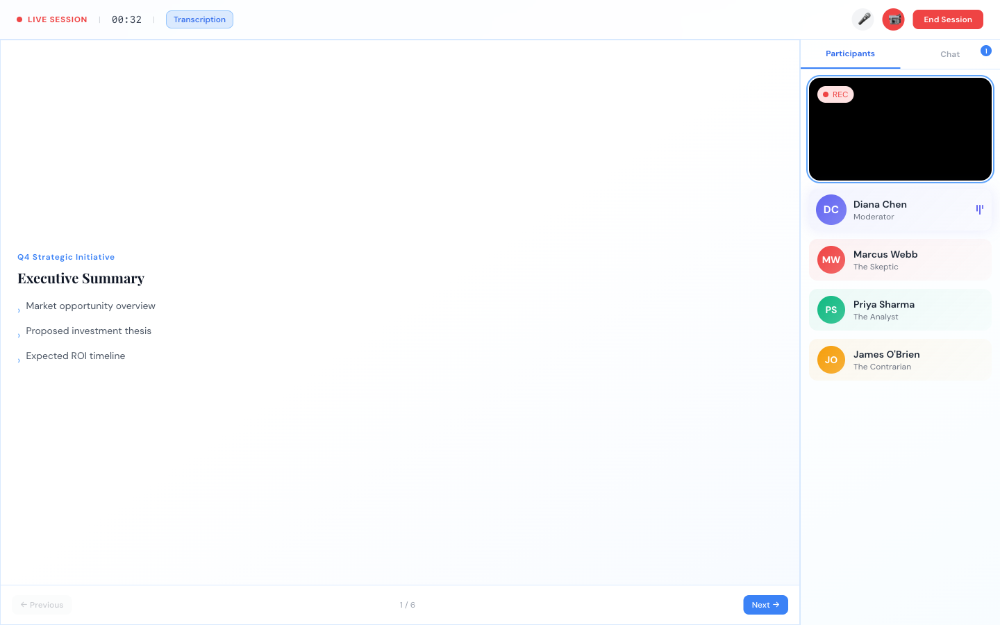

# HighStake

**AI-powered boardroom simulator for high-stakes presentation practice.**

HighStake lets executives rehearse critical presentations in a realistic virtual boardroom with AI-powered panel members who challenge, question, and stress-test your pitch — so you're battle-ready before the real thing.



Present your deck while four AI panelists — a moderator, a skeptic CFO, a data-driven analyst, and a contrarian board advisor — listen in real time, raise hands to challenge your claims, and engage in multi-turn Q&A exchanges. After the session, get scored across five dimensions with personalized coaching.

## Features

### Pre-Session Setup (Moderator-Led)
- **Interaction Mode**: Choose between section breaks, hand-raise, or free-flow interruptions
- **Intensity Level**: Friendly dry run → moderate challenge → full adversarial stress test
- **Focus Areas**: Direct the panel to pressure-test specific aspects (financials, GTM, competitive analysis, etc.)
- **Deck Upload**: Upload your PPTX/PDF and present with real slides

### Live Boardroom Session
- **4 AI Agent Personas**:
  - 🟣 **Diana Chen** (Moderator / Chief of Staff) — manages flow, turn-taking, and pacing
  - 🔴 **Marcus Webb** (The Skeptic / CFO) — challenges viability, questions ROI
  - 🟢 **Priya Sharma** (The Analyst / VP Strategy) — deep-dives into data and methodology
  - 🟡 **James O'Brien** (The Contrarian / Board Advisor) — finds logical gaps, worst-case scenarios
- Video-call-style interface with presenter + agent tiles
- Real-time slide viewer with navigation
- Live meeting chat with contextual AI questions
- Session timer and recording indicator

### Post-Session Debrief
- **Overall Score** with category breakdowns (clarity, confidence, data support, Q&A handling, structure)
- **Moderator's Summary** — narrative feedback from your session chair
- **Full Transcript** of all agent interactions
- **Prioritized Coaching** — specific, actionable improvement areas ranked by priority
- **Strengths** — what you did well

## Tech Stack

| Layer | Technology |
|-------|-----------|
| **Frontend** | React 18 + Vite, Zustand, Tailwind CSS |
| **Backend** | FastAPI + Python-SocketIO (async) |
| **LLM** | Gemini 2.5 Flash (question generation + coaching) |
| **TTS** | OpenAI TTS (distinct voice per agent) |
| **STT** | OpenAI Realtime / Whisper / Gemini Live |
| **Storage** | Local filesystem + JSON (no database) |

## Getting Started

```bash
# Install frontend dependencies
npm install

# Install backend dependencies
cd server && pip install -e .

# Set API key
echo "GEMINI_API_KEY=your-key" > server/.env

# Run both frontend + backend
npm run dev:all
```

The frontend runs on `http://localhost:3000`, the backend on `http://localhost:8000`.

## Architecture

```
src/                              server/app/
├── components/                   ├── api/            # REST routes
│   ├── SetupPhase.jsx            ├── ws/             # WebSocket events
│   ├── MeetingPhase.jsx          ├── services/       # Business logic
│   └── ReviewPhase.jsx           │   ├── agent_engine.py
├── stores/                       │   ├── agent_runner.py
│   ├── sessionStore.js           │   ├── llm_client.py
│   └── meetingStore.js           │   ├── tts_service.py
└── App.jsx                       │   └── session_store.py
                                  └── models/         # Enums only
```

## License

MIT
